# Adaptive Trajectory Tracking under Dynamic Shifts

Research benchmark for 2D trajectory tracking under mid-episode dynamics shifts. The repo now keeps one canonical result bundle, `outputs/research/paper_best`, which captures the strongest full-suite run and all final visuals.

The controller set is:

- `baseline`
- `adaptive_mlp`
- `adaptive_gru_nominal`
- `adaptive_gru_uncertainty`

`adaptive_gru_nominal` is the current overall RMSE winner in the canonical bundle, while `adaptive_gru_uncertainty` remains the main uncertainty-aware method and hits the intended gain band.

## Snapshot

| Item | Value |
|---|---:|
| Plant | 2D point mass |
| Baseline controller | Feedforward + PD + I |
| Learned estimators | `MLP`, `GRU + Gaussian NLL`, `GRU + uncertainty gating` |
| Shift modes | 4 single-shift modes + 4 compound OOD combinations |
| Trajectory families | 5 with hard unseen holdout |
| Canonical suite config | `configs/experiments/paper_best.yaml` |
| Canonical result bundle | `outputs/research/paper_best/` |

## Canonical Results

Source files:

- `outputs/research/paper_best/metrics/controller_summary.csv`
- `outputs/research/paper_best/metrics/controller_comparison.csv`
- `outputs/research/paper_best/metrics/bootstrap_intervals.csv`
- `outputs/research/paper_best/metrics/condition_breakdown.csv`
- `outputs/research/paper_best/metrics/suite_summary.csv`

Headline numbers from the canonical run:

| Controller | RMSE | Success Rate | Mean Disturbance Gain |
|---|---:|---:|---:|
| `adaptive_gru_nominal` | `0.1257` | `99.60%` | `1.0000` |
| `adaptive_gru_uncertainty` | `0.1278` | `98.81%` | `0.9682` |
| `adaptive_mlp` | `0.1426` | `97.62%` | `1.0000` |
| `baseline` | `0.2008` | `86.51%` | `1.0000` |

## Reproduce

```bash
python3 -m venv .venv
source .venv/bin/activate
python -m pip install --upgrade pip
pip install -r requirements.txt
python scripts/install_torch.py --mode auto --require-cuda-if-available
python scripts/check_cuda_env.py
```

Run the canonical suite:

```bash
python scripts/run_suite.py --suite configs/experiments/paper_best.yaml
```

Run with progress logging:

```bash
python scripts/run_suite_with_progress.py --suite configs/experiments/paper_best.yaml
```

Run in `tmux`:

```bash
bash scripts/run_suite_tmux.sh --suite configs/experiments/paper_best.yaml
```

Focus-case analysis for the canonical suite:

```bash
python scripts/analyze_focus_cases.py --suite configs/experiments/paper_best.yaml
```

Legacy single-model pipeline remains available:

```bash
python scripts/run_all.py --config configs/default.yaml
```

## Visual Gallery

All visuals below are served directly from the canonical `paper_best` bundle.

### Trajectory Comparison

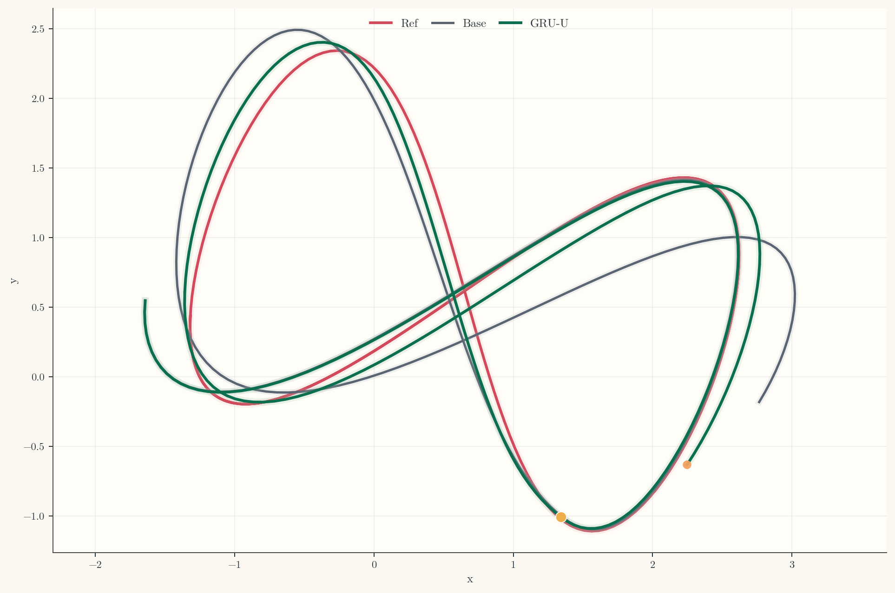

### Tracking Error vs Time

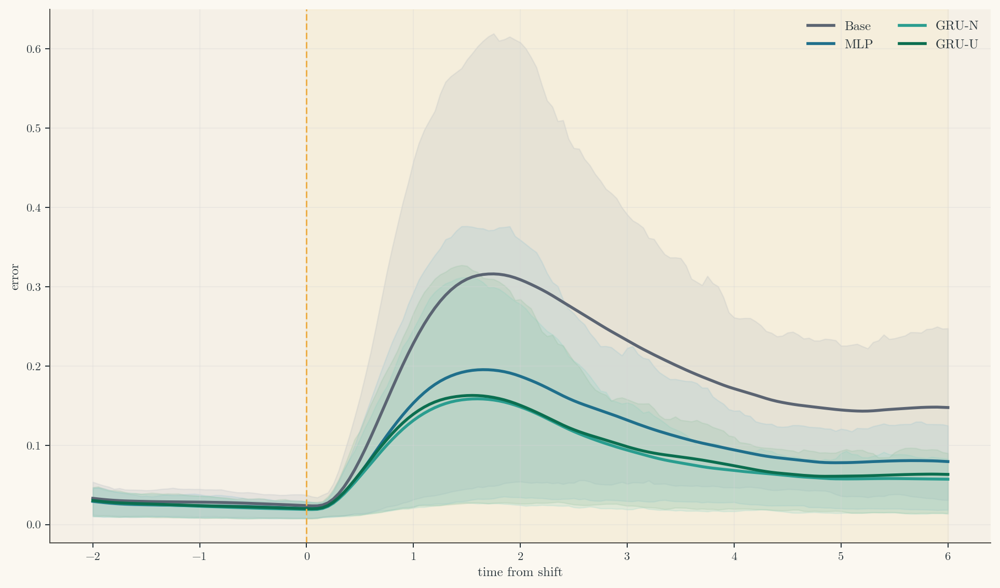

### Control Signal vs Time

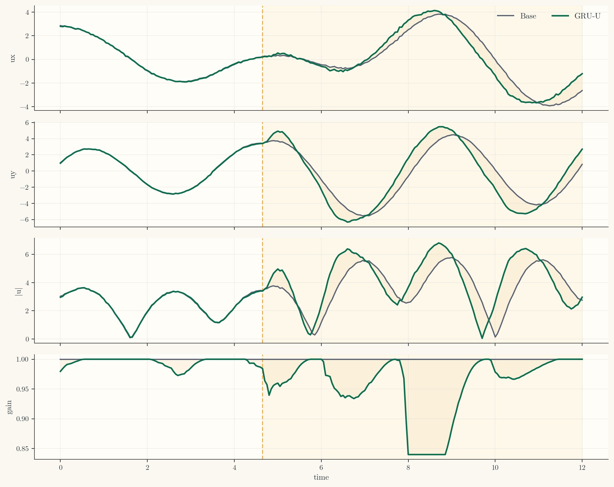

### Robustness Under Dynamics Shift

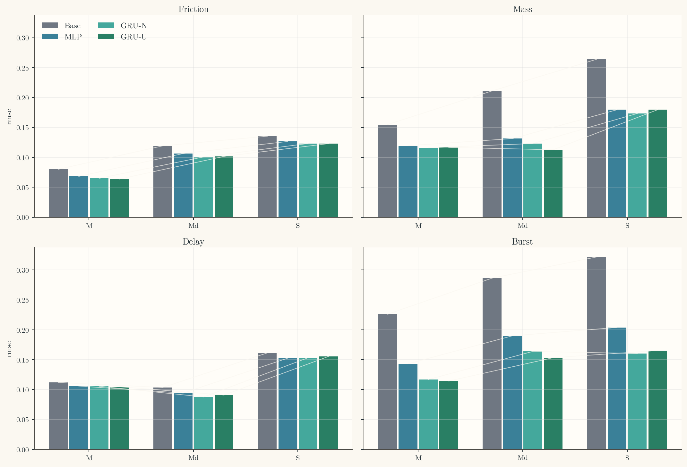

### RMSE Across Conditions

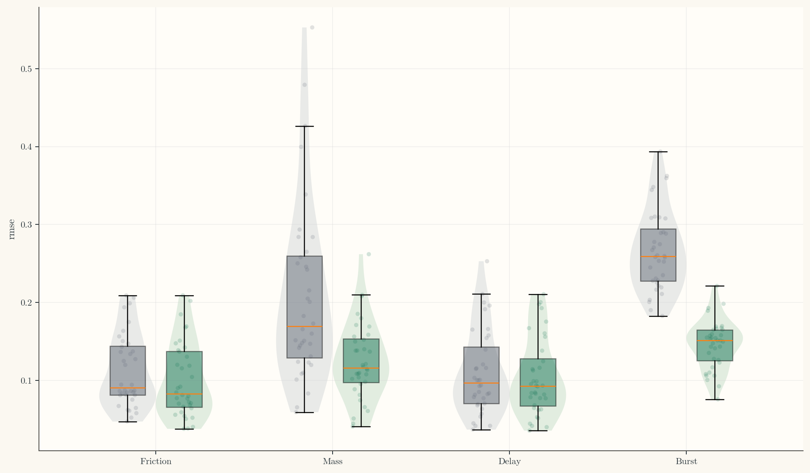

### Ablation Summary Dashboard

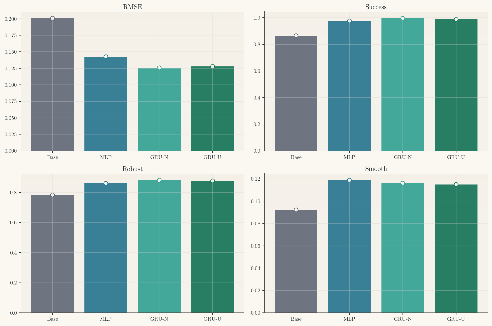

### ID vs Unseen vs Compound

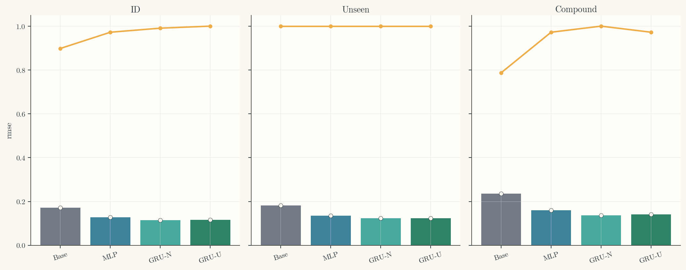

### Bootstrap CI Forest

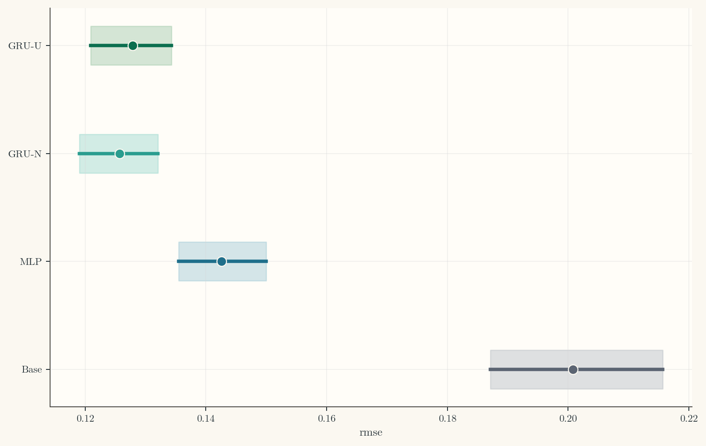

### Uncertainty vs Correction Gain

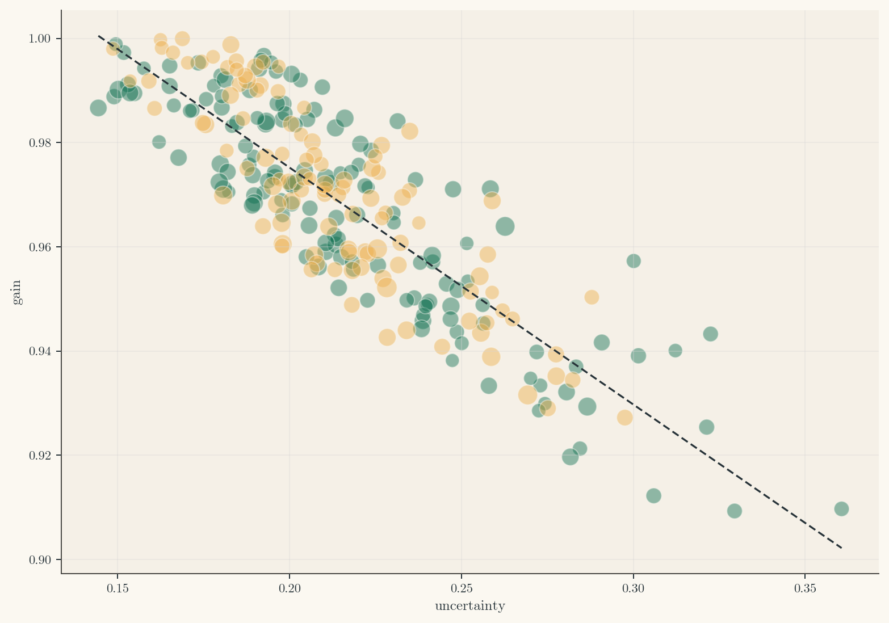

### Compound Shift Failure Recovery

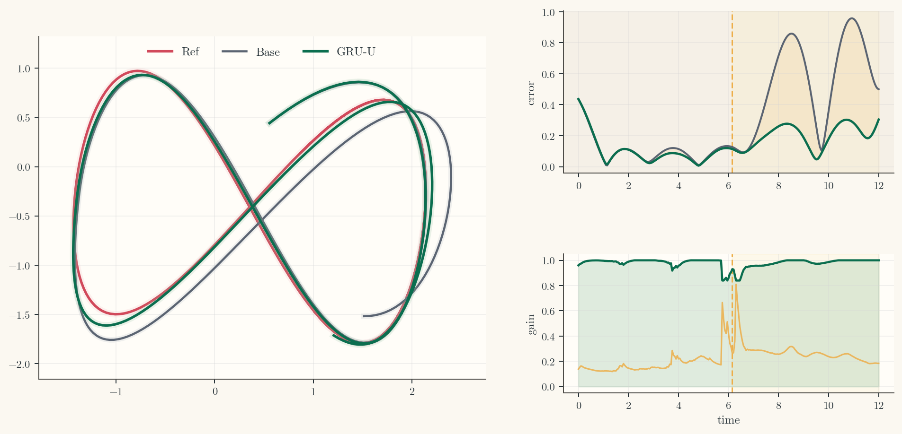

### Focus Burst Dashboard

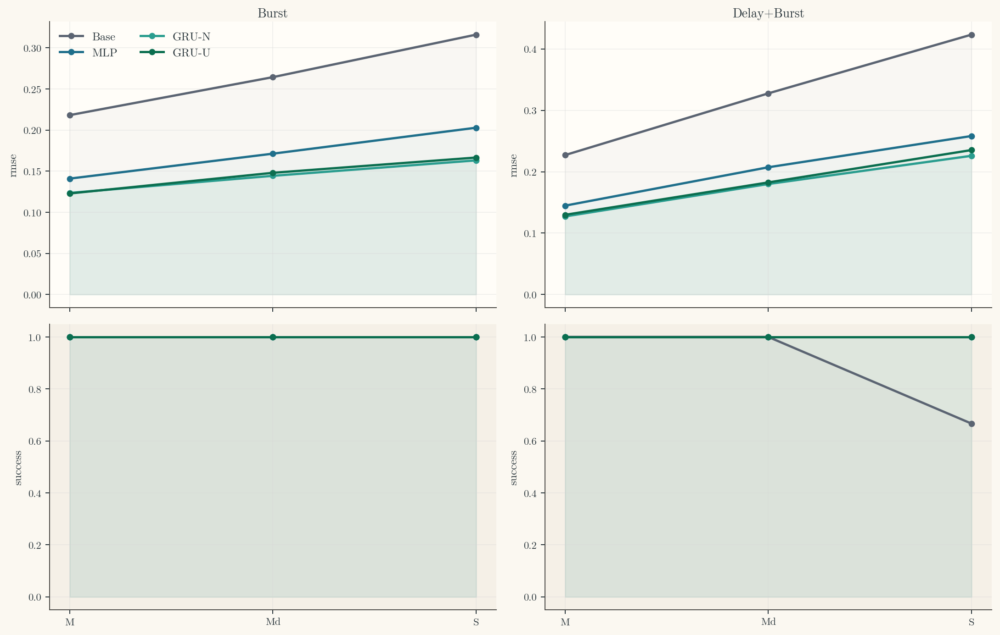

### Focus Burst Gap Heatmap

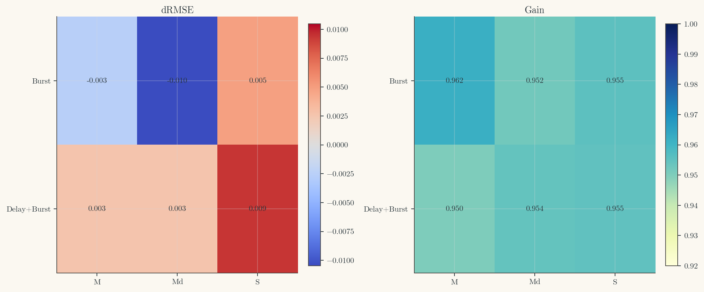

### Focus-Case Alignment Dashboard

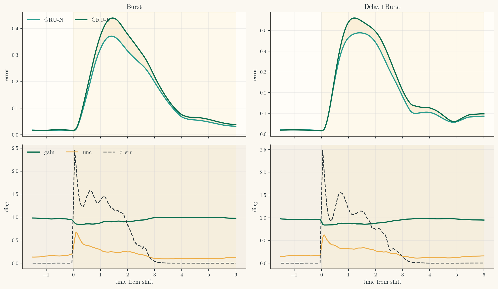

### Focus-Case Worst Episode Panels

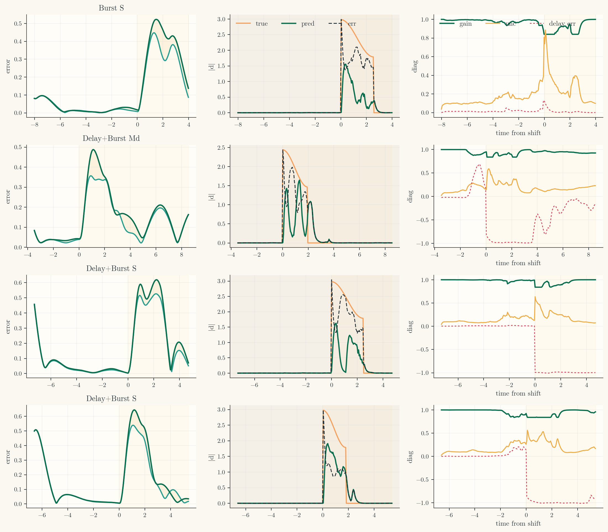

### Baseline vs Adaptive GIF


### Dynamics Shift Showcase GIF


### Unseen Trajectory Generalization GIF

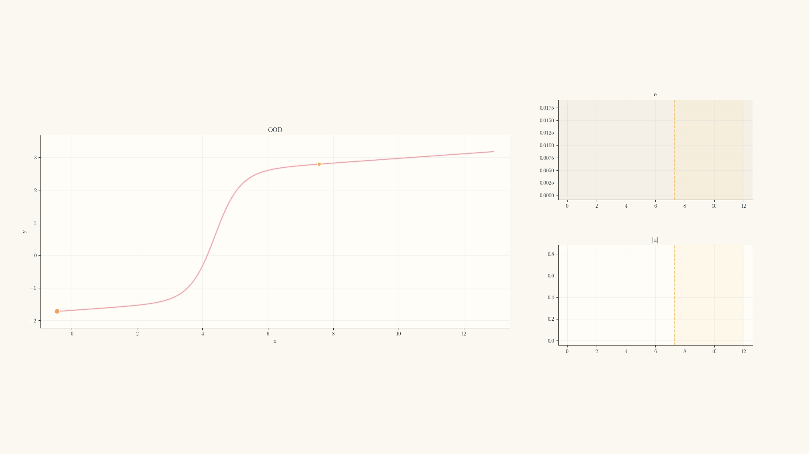

### Compound Shift Showcase GIF


### Uncertainty-Aware Recovery GIF


## Notes

- PyTorch is installed separately from `requirements.txt` so the bootstrap step can choose a CUDA wheel that matches the local NVIDIA driver.
- `scripts/check_cuda_env.py` audits the GPU, driver, installed Torch build, and the recommended PyTorch CUDA channel.
- Hard unseen trajectories use a holdout family rather than only wider parameter ranges.
- Compound shifts are evaluation-only and act as the main OOD robustness test.
- The visual stack is intentionally dense and visual-first, with minimal text and no bold typography.
