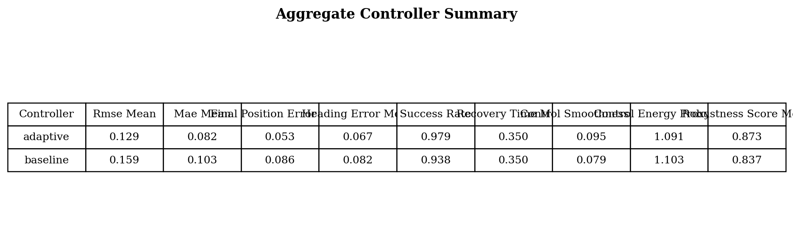

# Adaptive Trajectory Tracking under Changing Dynamics

Benchmark for 2D trajectory tracking under mid-episode dynamics shifts. The repository compares a nominal controller and a learned adaptive controller under changes in mass, friction, actuator delay, and disturbance conditions.

## Abstract

Trajectory tracking controllers are typically tuned around one nominal plant model, but operating conditions can change because of payload shifts, surface friction changes, actuator lag, and disturbance bursts. This repository implements a controlled synthetic benchmark around that setting. A nominal feedforward-plus-PD tracker is compared against an adaptive controller that estimates latent dynamics changes from recent tracking history using a small PyTorch model, then inserts those estimates into an interpretable corrected control law. The repository includes simulation, synthetic data generation, supervised training, evaluation, figure generation, and video rendering.

## Problem Formulation

The robot is modeled as a 2D point mass with state

`s_t = [x_t, y_t, v_{x,t}, v_{y,t}]`

and control

`u_t = [u_{x,t}, u_{y,t}]`.

The plant evolves under time-varying effective mass, friction, actuator delay, actuator lag, and disturbance force:

`v_{t+1} = v_t + dt * ((u_t^applied + d_t - c_t v_t) / m_t)`

`p_{t+1} = p_t + dt * v_{t+1}`

where:

- `m_t` is effective mass
- `c_t` is friction / drag coefficient
- `d_t` is external disturbance force
- `u_t^applied` may differ from `u_t` because of delay and actuator lag

Each episode contains a single randomized change point at which one shift mode becomes active.

## Shift Modes

- `friction_shift`: increases drag coefficient
- `mass_shift`: increases effective mass to simulate payload change
- `actuator_delay`: introduces discrete control delay and stronger actuator lag
- `disturbance_burst`: injects transient force disturbance and elevated observation noise

Each shift is sampled at `mild`, `medium`, or `severe` intensity.

## Reference Trajectories

The benchmark uses five trajectory families:

- circle
- figure-8
- spline
- lane change
- sinusoid

Trajectory parameters, initial conditions, and shift times are randomized. Evaluation also includes unseen trajectory variants produced from parameter ranges that differ from the easier train distribution.

## Controller Design

### Nominal baseline

The baseline controller is a feedforward-plus-PD tracker with a small integral term:

`a_des = a_ref + K_p (p_ref - p) + K_d (v_ref - v) + K_i ∫(p_ref - p) dt`

`u_base = m_nom * a_des + c_nom * v`

This controller assumes fixed nominal mass and friction.

### Adaptive controller

The adaptive method keeps the same tracking structure but estimates latent dynamics quantities from recent history. A small MLP predicts:

- mass ratio
- friction ratio
- delay severity
- disturbance force in x
- disturbance force in y

Those predictions are used inside an analytic corrected controller:

`u_adapt = m_hat * a_des + c_hat * v - d_hat + k_lead * severity_hat * (u_base - u_prev)`

This keeps the adaptive layer interpretable. The learned model does not directly output a black-box control action.

### Model inputs

The estimator observes:

- current state
- tracking error
- recent state and control history
- estimated acceleration from history
- baseline control command
- previous control command
- current and next-step reference features

### Model outputs

- `mass_ratio`
- `friction_ratio`
- `delay_severity`
- `disturbance_x`
- `disturbance_y`

## Learning Setup

The adaptive module is trained with supervised learning on synthetic rollouts.

### Data generation

1. Sample a trajectory family and parameters.
2. Sample initial condition offsets.
3. Sample one shift type, one intensity, and one shift time.
4. Roll out the nominal baseline controller on the changing-dynamics simulator.
5. Convert rollout history into supervised features and latent targets.

### Train / validation / test

- Train episodes: `72`
- Validation episodes: `24`
- Test episodes: `36`
- Evaluation seeds: `2024, 2025, 2026`
- Episodes per shift condition per seed: `4`

### Training objective

The estimator is trained with normalized regression targets using MSE loss. The checkpoint stores model weights plus normalization statistics needed for deployment.

## Evaluation Protocol

The evaluation suite compares baseline and adaptive controllers on matched episodes across:

- all shift types
- all shift intensities
- multiple seeds
- seen and unseen trajectory variants

Saved metrics include:

- tracking RMSE
- MAE
- final position error
- heading error
- success rate
- recovery time after shift
- control smoothness
- control energy proxy
- robustness score

Primary result files:

- [outputs/metrics/controller_summary.csv](outputs/metrics/controller_summary.csv)
- [outputs/metrics/aggregate_metrics.csv](outputs/metrics/aggregate_metrics.csv)
- [outputs/metrics/per_episode_metrics.csv](outputs/metrics/per_episode_metrics.csv)

## Results

Using the default configuration currently stored in this repository:

| Metric | Baseline | Adaptive | Change |
|---|---:|---:|---:|
| RMSE | 0.1587 | 0.1294 | -18.5% |
| MAE | 0.1034 | 0.0824 | -20.3% |
| Final position error | 0.0856 | 0.0534 | -37.6% |
| Heading error | 0.0825 | 0.0667 | -19.2% |
| Success rate | 93.75% | 97.92% | +4.17 pp |
| Control smoothness | 0.0786 | 0.0951 | worse |
| Control energy proxy | 1.1028 | 1.0914 | -1.03% |

Matched-episode summary:

- Adaptive achieves lower RMSE in `92.36%` of evaluation episodes.
- Adaptive achieves lower final position error in `81.25%` of evaluation episodes.
- Adaptive increases success on `6` episodes and does not reduce success on any matched episode.

Per-shift observations:

- `disturbance_burst`: largest RMSE reduction among the four shift types
- `mass_shift`: lower RMSE than baseline across all three intensities
- `friction_shift`: consistent but moderate gains
- `actuator_delay`: lower RMSE than baseline, with a smaller margin than the other shift types

## Visualizations

### Video previews

**Baseline vs Adaptive**


MP4: [outputs/videos/01_baseline_vs_adaptive.mp4](outputs/videos/01_baseline_vs_adaptive.mp4)

**Failure to Recovery**


MP4: [outputs/videos/05_failure_to_recovery.mp4](outputs/videos/05_failure_to_recovery.mp4)

### Figures

#### Trajectory comparison


#### Error aligned around the dynamics shift


#### Control signal comparison


#### Aggregate robustness by shift type and intensity


#### RMSE distribution across conditions


#### Controller-level summary table



## Repository Structure

```text
adaptive_tracking_project/
├── README.md
├── requirements.txt
├── Makefile
├── configs/
│   └── default.yaml
├── scripts/
│   ├── generate_data.py
│   ├── train.py
│   ├── evaluate.py
│   ├── make_figures.py
│   ├── make_videos.py
│   └── run_all.py
├── src/
│   ├── controllers/
│   ├── data/
│   ├── dynamics/
│   ├── evaluation/
│   ├── models/
│   ├── training/
│   ├── utils/
│   └── visualization/
└── outputs/
    ├── checkpoints/
    ├── datasets/
    ├── figures/
    ├── metrics/
    └── videos/
```

## Reproducibility

### Environment setup

```bash
cd /home/aimldl/adaptive-trajectory-tracking-changing-dynamics/adaptive_tracking_project
python3 -m venv .venv
source .venv/bin/activate
python -m pip install --upgrade pip
pip install -r requirements.txt
```

### Full pipeline

```bash
python scripts/run_all.py --config configs/default.yaml
```

### Stepwise execution

```bash
python scripts/generate_data.py --config configs/default.yaml
python scripts/train.py --config configs/default.yaml
python scripts/evaluate.py --config configs/default.yaml
python scripts/make_figures.py --config configs/default.yaml
python scripts/make_videos.py --config configs/default.yaml
```

## Produced Artifacts

Required figures:

- `outputs/figures/trajectory_comparison.png`
- `outputs/figures/tracking_error_vs_time.png`
- `outputs/figures/control_signal_vs_time.png`
- `outputs/figures/robustness_under_dynamics_shift.png`
- `outputs/figures/rmse_boxplot_across_conditions.png`
- `outputs/figures/results_table.png`

Required videos:

- `outputs/videos/01_baseline_vs_adaptive.mp4`
- `outputs/videos/02_adaptive_rollout_single_episode.mp4`
- `outputs/videos/03_dynamics_shift_showcase.mp4`
- `outputs/videos/04_unseen_trajectory_generalization.mp4`
- `outputs/videos/05_failure_to_recovery.mp4`

Other outputs:

- `outputs/checkpoints/best_model.pt`
- `outputs/datasets/*.npz`
- `outputs/metrics/*.csv`
- `outputs/metrics/rollouts/*.npz`

## Limitations

- The benchmark is reproducible, but it does not cover the full range of modeling and evaluation choices that would be expected in a broader research study.
- The current `recovery_time` metric is weakly discriminative under the present thresholds.
- The current unseen split is milder than the hardest out-of-distribution settings one could define.
- The adaptive controller has higher control variation than the nominal baseline under the current metric.

## Potential Extensions

- harder unseen trajectory and shift combinations
- stronger delay models and coupled actuator saturation
- uncertainty-aware estimators
- recurrent or temporal-convolution estimators
- ablations on feature history length and target parameterization
- tighter post-shift recovery metrics

## Scope

The repository covers:

- robotics simulation under distribution shift
- synthetic data generation for adaptive control
- interpretable learning-based correction on top of a classical controller
- reproducible evaluation and visualization
- publication-style artifacts generated entirely in Python
