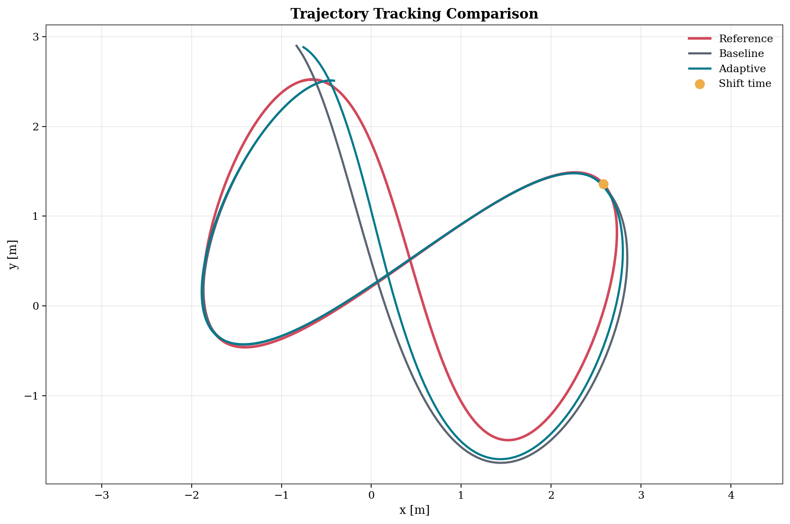
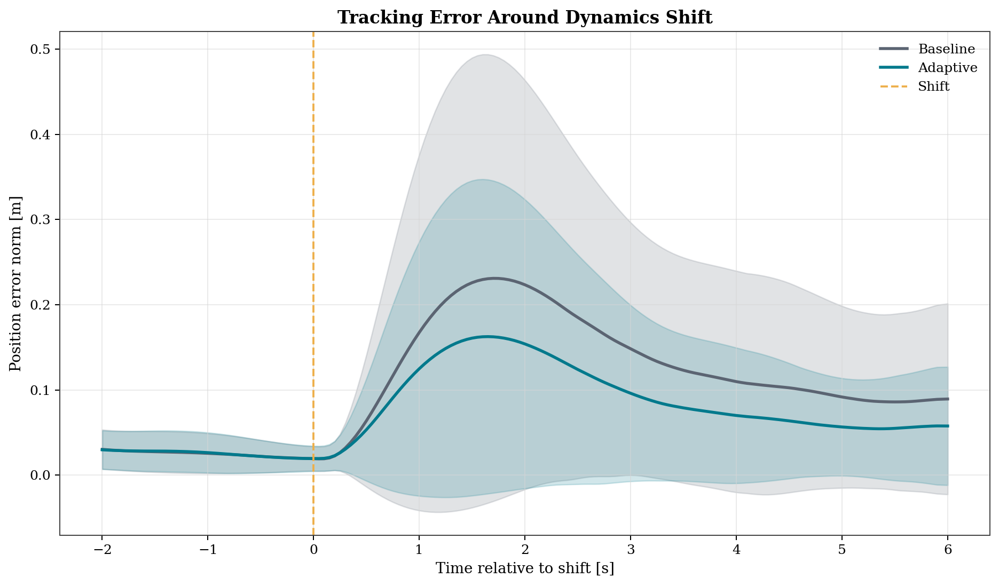
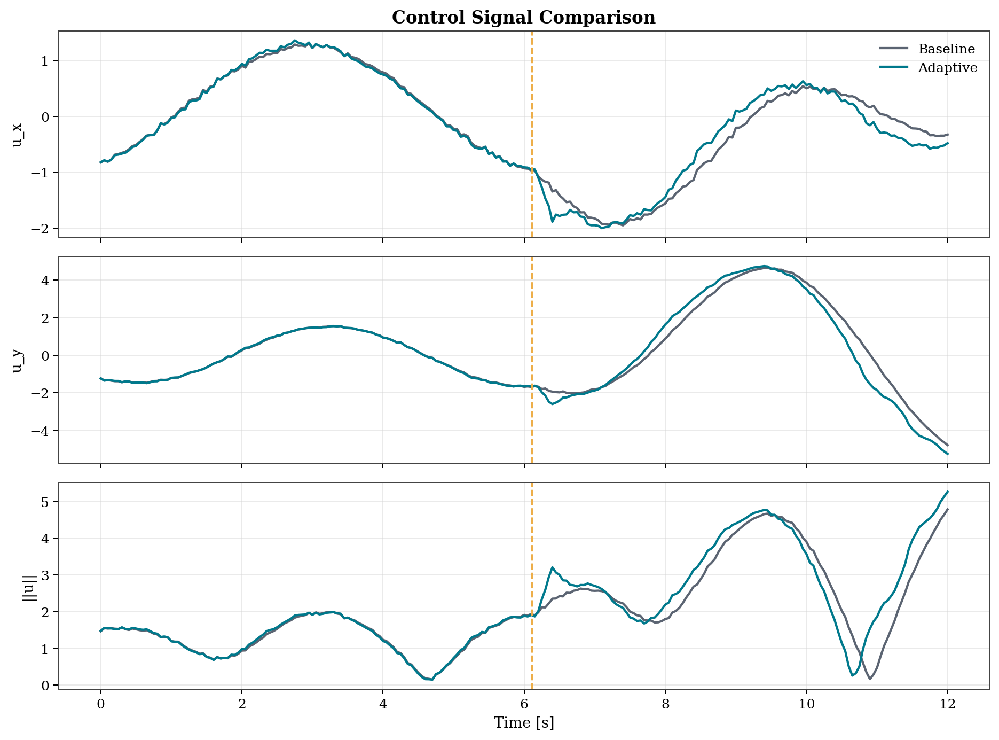
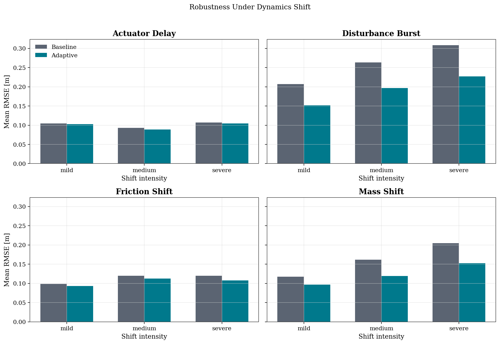
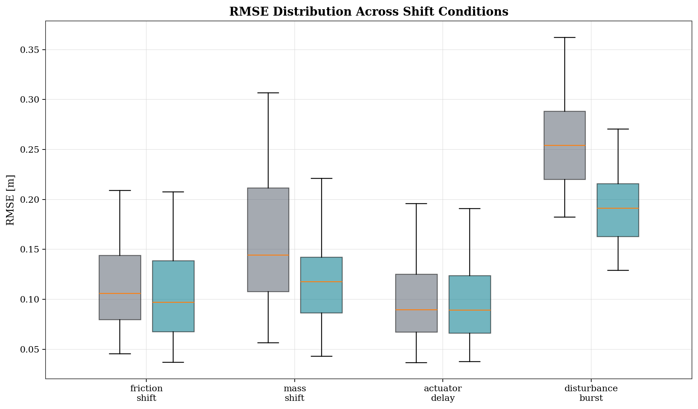

# Adaptive Trajectory Tracking under Changing Dynamics

<p align="center">
  
  
</p>

2D trajectory-tracking benchmark with mid-episode dynamics shifts. A nominal tracker is compared against a learned adaptive controller under friction, mass, actuator-delay, and disturbance changes.

| Quick fact | Value |
|---|---:|
| Plant | 2D point mass |
| Baseline | Feedforward + PD + I |
| Adaptive method | MLP estimator + analytic correction |
| Shift modes | 4 |
| Trajectory families | 5 |
| RMSE change | `-18.5%` |
| Final position error change | `-37.6%` |
| Success rate | `97.92%` adaptive vs `93.75%` baseline |

## Visuals

| | |
|---|---|
|  |  |
|  |  |
|  | 

Videos:

- [outputs/videos/01_baseline_vs_adaptive.mp4](outputs/videos/01_baseline_vs_adaptive.mp4)
- [outputs/videos/02_adaptive_rollout_single_episode.mp4](outputs/videos/02_adaptive_rollout_single_episode.mp4)
- [outputs/videos/03_dynamics_shift_showcase.mp4](outputs/videos/03_dynamics_shift_showcase.mp4)
- [outputs/videos/04_unseen_trajectory_generalization.mp4](outputs/videos/04_unseen_trajectory_generalization.mp4)
- [outputs/videos/05_failure_to_recovery.mp4](outputs/videos/05_failure_to_recovery.mp4)

## Setup

| Component | Choice |
|---|---|
| State | `[x, y, vx, vy]` |
| Control | `[ux, uy]` |
| Trajectories | circle, figure-8, spline, lane change, sinusoid |
| Shift modes | friction shift, mass shift, actuator delay, disturbance burst |
| Training | supervised regression on synthetic rollouts |
| Outputs | figures, videos, CSV metrics, checkpoint |

Plant update:

`v_{t+1} = v_t + dt * ((u_t^applied + d_t - c_t v_t) / m_t)`

`p_{t+1} = p_t + dt * v_{t+1}`

Baseline controller:

`u_base = m_nom * a_des + c_nom * v`

Adaptive controller:

`u_adapt = m_hat * a_des + c_hat * v - d_hat + k_lead * severity_hat * (u_base - u_prev)`

The estimator predicts:

- `mass_ratio`
- `friction_ratio`
- `delay_severity`
- `disturbance_x`
- `disturbance_y`

## Results

| Metric | Baseline | Adaptive | Change |
|---|---:|---:|---:|
| RMSE | 0.1587 | 0.1294 | -18.5% |
| MAE | 0.1034 | 0.0824 | -20.3% |
| Final position error | 0.0856 | 0.0534 | -37.6% |
| Heading error | 0.0825 | 0.0667 | -19.2% |
| Success rate | 93.75% | 97.92% | +4.17 pp |
| Control smoothness | 0.0786 | 0.0951 | higher variation |
| Control energy proxy | 1.1028 | 1.0914 | -1.03% |

Matched-episode summary:

- lower RMSE in `92.36%` of evaluation episodes
- lower final position error in `81.25%` of evaluation episodes
- success improved on `6` episodes and decreased on `0`

Shift-wise summary:

- `disturbance_burst`: largest RMSE reduction
- `mass_shift`: lower RMSE at all intensities
- `friction_shift`: consistent improvement
- `actuator_delay`: smaller but positive gain

Primary metrics files:

- [outputs/metrics/controller_summary.csv](outputs/metrics/controller_summary.csv)
- [outputs/metrics/aggregate_metrics.csv](outputs/metrics/aggregate_metrics.csv)
- [outputs/metrics/per_episode_metrics.csv](outputs/metrics/per_episode_metrics.csv)

## Run

```bash
cd adaptive_tracking_project
python3 -m venv .venv
source .venv/bin/activate
python -m pip install --upgrade pip
pip install -r requirements.txt
```

Full pipeline:

```bash
python scripts/run_all.py --config configs/default.yaml
```

Step-by-step:

```bash
python scripts/generate_data.py --config configs/default.yaml
python scripts/train.py --config configs/default.yaml
python scripts/evaluate.py --config configs/default.yaml
python scripts/make_figures.py --config configs/default.yaml
python scripts/make_videos.py --config configs/default.yaml
```

## Layout

```text
adaptive_tracking_project/
├── configs/default.yaml
├── scripts/
├── src/
│   ├── controllers/
│   ├── data/
│   ├── dynamics/
│   ├── evaluation/
│   ├── models/
│   ├── training/
│   ├── utils/
│   └── visualization/
└── outputs/
    ├── checkpoints/
    ├── datasets/
    ├── figures/
    ├── metrics/
    └── videos/
```

## Notes

- `recovery_time` is currently a weak metric under the default threshold.
- The unseen split is valid but still milder than a harder out-of-distribution test.
- The adaptive controller improves tracking but has higher control variation than the baseline.
